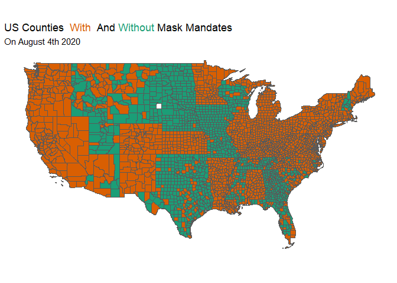

County Level Mask Mandates
================

This package exists to allow easier access to the data provided by
Austin L. Wright Et Al. in the working paper Tracking Mask Mandates
during the COVID-19 Pandemic.

I had the wonderful opportunity to spend the summer in the University of
Chicago DPSS program and worked on the capstone/lab that helped collect
and validate the data. I wanted to make the data which was available
easier to access for R users. Using this package users can easily make
visualizations showing where and when mandates were adopted.

<!-- -->

## Installation

This package is currently only available via github.

You can install it from [Github](github.com) using the following
commands

``` r
#install using devtools
devtools::install_github("delabj/USMaskMandates)

#install using remotes
remotes::install_github("delabj/USMaskMandates)
```

## About the data

Data were collected and refined by students and staff at the University
of Chicago, led by Austin L. Wright. In particular the data was
collected and validated by two labs of students, the IPAL Lab, and the
DPSS Lab. As the data is ever changing, [corrections and revisions can
be recommended to the original data authors via a
form.](https://docs.google.com/forms/u/2/d/e/1FAIpQLSfi4NTKH8_kFD8hb7_oWdcY2pIp9_YEbwvGs7kLmqU99_rQvw/viewform?usp=send_form)

Two data sets are provided. One is called `mask_mandates` and the other
`raw_mandates`.

### Raw Mandates

This data set comes directly from the raw data provided by the paper
authors. See `?raw_mandates` for specific details.

The following is a sampling of the data from this source.

``` r
raw_mandates[sample(nrow(raw_mandates), 10),] 
```

    ## # A tibble: 10 x 19
    ##    state_fips state_name county_fips county_name county_mask_pol~
    ##         <int> <chr>            <int> <chr>       <chr>           
    ##  1         19 IOWA             19053 Decatur Co~ <NA>            
    ##  2         39 OHIO             39131 Pike County 23Jul2020       
    ##  3         55 WISCONSIN        55035 Eau Claire~ <NA>            
    ##  4         55 WISCONSIN        55129 Washburn C~ <NA>            
    ##  5         13 GEORGIA          13029 Bryan Coun~ <NA>            
    ##  6         45 SOUTH CAR~       45071 Newberry C~ 01Jul2020       
    ##  7          6 CALIFORNIA        6049 Modoc Coun~ <NA>            
    ##  8         48 TEXAS            48323 Maverick C~ 02Jul2020       
    ##  9         40 OKLAHOMA         40097 Mayes Coun~ <NA>            
    ## 10         13 GEORGIA          13049 Charlton C~ <NA>            
    ## # ... with 14 more variables: county_mask_policy_end <chr>,
    ## #   county_conditions <chr>, county_source <chr>, county_escalation <chr>,
    ## #   county_defiance <chr>, county_edate <int>, state_mask_policy_start <chr>,
    ## #   state_mask_policy_end <chr>, state_conditions <chr>, state_source <chr>,
    ## #   state_edate <int>, earliest_policy_edate <int>, county_fips_str <int>,
    ## #   date_format <chr>

### Mask Mandates

I’ve taken the liberty of cleaning the data, by adding appropriate
padding to FIPS codes, standardizing data formats and dropping duplicate
columns. More details can be found by using `?mask_mandates` in the R
console.

The following is a sample of random rows from the cleaned data

``` r
mask_mandates[sample(nrow(mask_mandates), 10),] 
```

    ## # A tibble: 10 x 15
    ##    state_fips state_name county_fips country_name county_policy_s~
    ##    <chr>      <chr>      <chr>       <chr>        <date>          
    ##  1 40         Oklahoma   40123       Pontotoc Co~ NA              
    ##  2 29         Missouri   29081       Harrison Co~ NA              
    ##  3 40         Oklahoma   40025       Cimarron Co~ NA              
    ##  4 17         Illinois   17039       De Witt Cou~ NA              
    ##  5 12         Florida    12093       Okeechobee ~ NA              
    ##  6 23         Maine      23031       York County  NA              
    ##  7 20         Kansas     20037       Crawford Co~ 2020-03-20      
    ##  8 01         Alabama    01117       Shelby Coun~ 2020-07-20      
    ##  9 13         Georgia    13173       Lanier Coun~ NA              
    ## 10 17         Illinois   17203       Woodford Co~ 2020-01-20      
    ## # ... with 10 more variables: county_policy_end <date>,
    ## #   county_policy_conditions <chr>, county_policy_source <chr>,
    ## #   county_policy_defiance <chr>, county_policy_escalation <chr>,
    ## #   state_policy_start <date>, state_policy_end <date>,
    ## #   state_policy_conditions <chr>, state_policy_source <chr>,
    ## #   earliest_policy_date <date>

## Examples

### Least Compliant States

``` r
mask_mandates %>%
  mutate(defy_status = if_else(is.na(county_policy_defiance), "Comply", "Defy" )) %>%
  group_by(state_name, defy_status) %>%
  count() %>% 
  pivot_wider(names_from = defy_status, values_from = n ) %>%
  transmute(Comply = replace_na(Comply, 0),
    Defy   = replace_na(Defy, 0),
    percent_compliant = Comply/(Comply+Defy), 
    state = state_name) %>%
  na.omit() %>%
  arrange(percent_compliant) %>%
  head( 10) %>%
  ggplot(aes(y= forcats::fct_reorder(state, percent_compliant), 
             x=percent_compliant, 
             fill = forcats::fct_reorder(state, percent_compliant)))+
  geom_col()+
  labs(title = "10 Least Compliant States", 
       y=NULL)+
  theme_minimal()+
  delabj::scale_fill_delabj()+
  delabj::legend_none()+
  theme(plot.title.position = "plot")
```

<!-- -->

### Map By Date

county\_shp is a local shapefile I have, that I’m unsure of distribution
rights.

``` r
 valid_states <- unique(mask_mandates$state_fips)

# join to shape fule
plotting_data <- county_shp %>%
  left_join(mask_mandates %>%
              mutate(STATEFP = state_fips,
                     COUNTYFP = stringr::str_sub(county_fips, -3, -1))) %>%
# Filter out non lower 48 states
  filter(!c(state_fips %in% c("02", "15" ,"11", "60", "66", "69", "72", "78")), 
         STATEFP %in% valid_states, 
         !is.na(state_fips)) %>% arrange(state_name)
```

    ## Joining, by = c("STATEFP", "COUNTYFP")

``` r
ggplot(plotting_data)+
  geom_sf(aes(fill = earliest_policy_date), 
          size = 0.1)+
  labs(
    title = "Mask Mandate Starting Dates",
    subtitle = "as of Augest 4th 2020", 
    fill = "Mandate Start Date"
    )+
theme_minimal()+
  theme(plot.title = element_markdown(), 
        axis.text = element_blank(), 
        plot.title.position = "plot")+
  delabj::gridlines_off()+
  scale_fill_date(low = "#8856a7",
                  high = "#e0ecf4", 
                  na.value = "#fc8d59")+
  theme(legend.position = c(.15,.15), 
        legend.direction = "horizontal")+
  guides(fill = guide_colorbar(title.position = "top", 
                               title.hjust = 0, 
                               barwidth = 10, 
                               frame.colour = "black") 
         )
```

<!-- -->

## Additional data use information

In order to make this data more accessible, Austin L. Wright. Published
this data \[With their COVID-19
research.\](remotes::install\_github("delabj/USMaskMandates) They ask
that anyone using this data cite the working paper and acknowledge the
source of the data. I have provided a link and citation below for the
working paper.

## References

[Data Release and Working
Paper:](https://bfi.uchicago.edu/wp-content/uploads/BFI_WP_2020104.pdf)

  - Wright, Austin L. and Chawla, Geet and Chen, Luke and Farmer,
    Anthony, Tracking Mask Mandates During the Covid-19 Pandemic (August
    4, 2020). University of Chicago, Becker Friedman Institute for
    Economics Working Paper No. 2020-104, Available at SSRN:
    <https://ssrn.com/abstract=3667149>

[Related Paper on Mask Use and
Partisanship:](https://papers.ssrn.com/sol3/papers.cfm?abstract_id=3664779)

  - Milosh, Maria and Painter, Marcus and Van Dijcke, David and Wright,
    Austin L., Unmasking Partisanship: How Polarization Influences
    Public Responses to Collective Risk (July 31, 2020). University of
    Chicago, Becker Friedman Institute for Economics Working Paper
    No. 2020-102, Available at SSRN:
    <https://ssrn.com/abstract=3664779> or
    <http://dx.doi.org/10.2139/ssrn.3664779>
